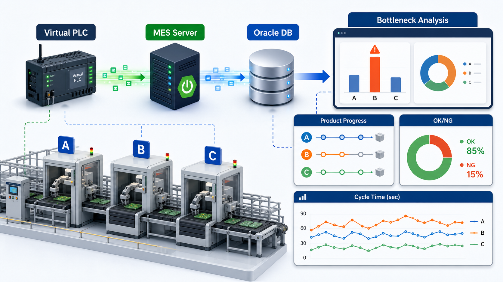
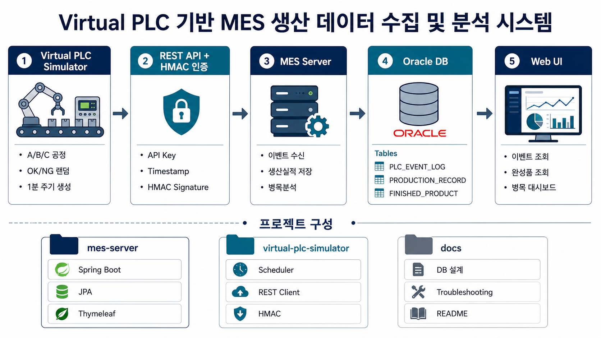
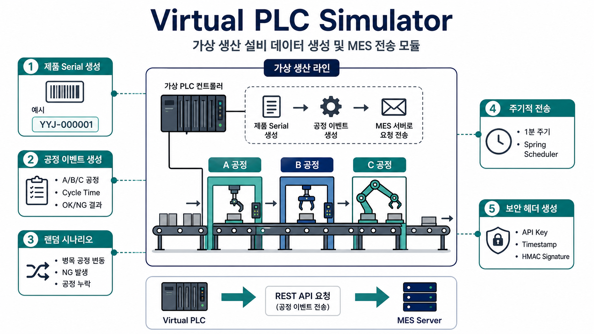
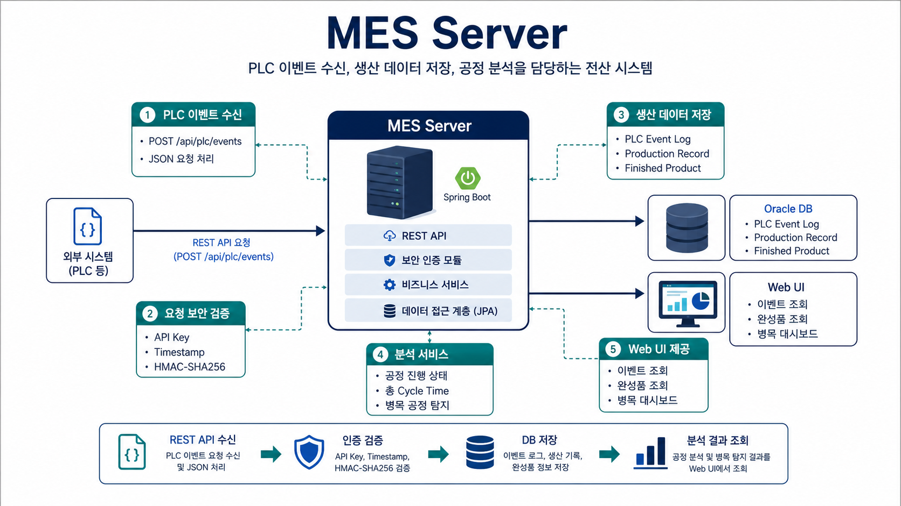
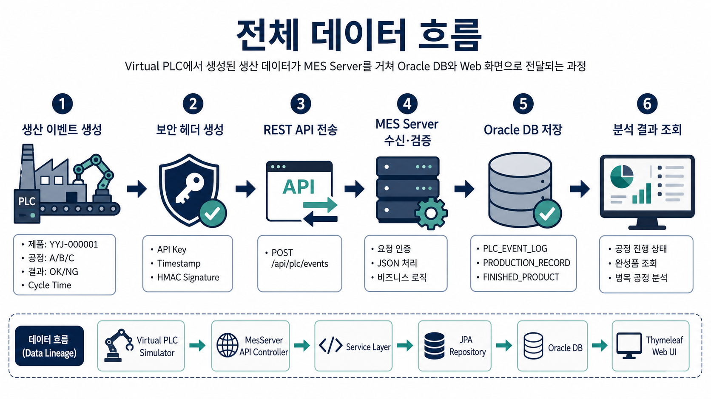
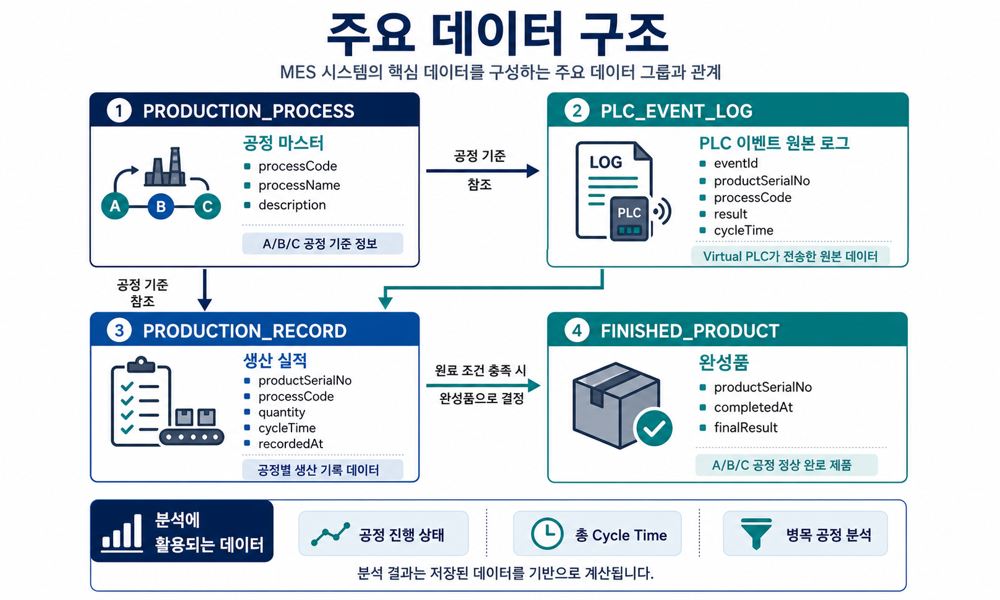
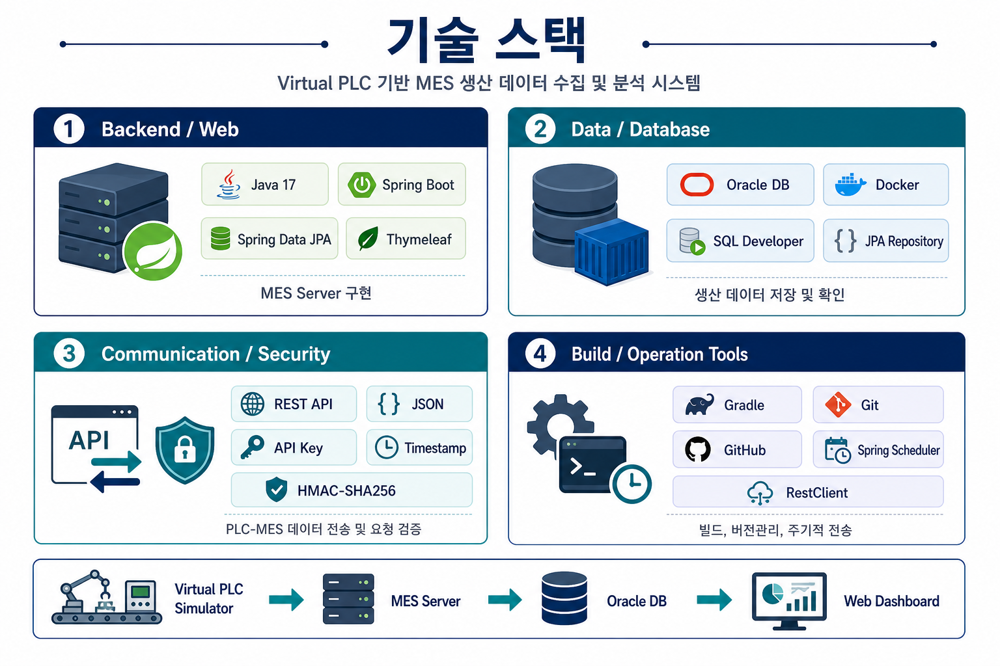

# Virtual PLC 기반 MES 생산 데이터 수집 및 분석 시스템



## 1. 프로젝트 개요

제조 현장에서 설비 데이터가 MES로 수집되는 흐름을 이해하기 위해 진행한 토이 프로젝트입니다.

Virtual PLC Simulator가 생산라인의 공정 데이터를 생성하고, MES Server는 REST API를 통해 데이터를 수신하여 Oracle DB에 저장합니다. 이후 저장된 데이터를 기반으로 PLC 이벤트 이력, 생산 실적, 완성품 현황, 제품별 공정 진행 상태, 병목 공정 분석 결과를 조회할 수 있도록 구현했습니다.

이 프로젝트는 단순 CRUD 웹 애플리케이션이 아니라, 제조 현장의 설비 데이터가 사내 전산 시스템으로 수집되고 분석되는 전체 흐름을 직접 설계하고 구현하는 것을 목표로 했습니다.

## 2. 프로젝트 목적

- PLC에서 MES로 생산 데이터가 전달되는 흐름 이해
- REST API 기반 설비 데이터 수집 구조 구현
- Oracle DB를 이용한 생산 데이터 저장 및 조회
- 공정별 사이클타임 기반 병목 공정 분석
- 제품 Serial Number 기반 공정 진행 상태 추적
- API Key, Timestamp, HMAC Signature 기반 요청 인증 구현
- 장애 상황을 Ticket 형태로 정리하며 운영 관점의 문제 해결 경험 확보
- 제조 IT / MES / DB / 인프라 운영 직무와 연결되는 프로젝트 경험 정리

## 3. 전체 아키텍처 및 프로젝트 구성



## 4. 주요 기능

### Virtual PLC Simulator



### MES Server



## 5. 데이터 흐름



## 6. 병목 공정 분석 방식

공정별 평균 Cycle Time을 계산한 뒤, 시간당 처리량을 산출했습니다.

```text
시간당 처리량 = 3600 / 평균 Cycle Time
```

시간당 처리량이 가장 낮은 공정을 병목 공정으로 판단했습니다.

예를 들어 B 공정의 평균 Cycle Time이 가장 길다면, B 공정의 시간당 처리량이 가장 낮아지고 해당 공정이 병목으로 탐지됩니다.

## 7. 보안 설계

PLC와 MES Server 간 요청 위변조를 방지하기 위해 다음 인증 방식을 적용했습니다.

### API Key

허용된 Virtual PLC에서 들어온 요청인지 확인합니다.

### Timestamp

요청 시간이 서버 기준으로 허용 범위를 벗어나면 차단합니다. 이를 통해 오래된 요청을 재사용하는 공격을 방지할 수 있습니다.

### HMAC Signature

요청 데이터와 Secret Key를 기반으로 HMAC-SHA256 Signature를 생성합니다. MES Server는 동일한 방식으로 Signature를 다시 계산하여 요청 데이터가 중간에 변경되지 않았는지 검증합니다.

## 8. 주요 데이터



## 9. 기술 스택



## 10. 실행 방법

### Oracle DB 실행

```bash
docker start yyj-oracle
```

### MES Server 실행

```bash
cd mes-server
./gradlew bootRun
```

MES Server는 기본적으로 `http://localhost:8080`에서 실행됩니다.

### Virtual PLC Simulator 실행

```bash
cd virtual-plc-simulator
./gradlew bootRun
```

Virtual PLC Simulator는 기본적으로 `http://localhost:9090`에서 실행됩니다.

## 11. 장애 이력 관리 및 트러블슈팅

프로젝트를 진행하면서 발생한 주요 오류와 해결 과정을 Ticket 형식으로 정리했습니다.

단순 에러 해결 기록이 아니라, 운영 환경에서 장애를 관리하는 방식처럼 다음 항목을 기준으로 정리했습니다.

- 발생 상황
- 주요 로그 또는 증상
- 원인 분석
- 해결 방법
- 재발 방지 방안

자세한 내용은 아래 문서에서 확인할 수 있습니다.

[트러블슈팅 문서 보기](docs/TROUBLESHOOTING.md)

## 12. 느낀 점

이 프로젝트를 통해 제조 현장에서 발생하는 설비 데이터가 MES와 같은 사내 전산 시스템으로 수집되는 흐름을 이해할 수 있었습니다.

또한 단순히 데이터를 저장하는 것에 그치지 않고, 수집된 데이터를 기반으로 생산 실적, 완성품, 제품 진행 상태, 병목 공정을 분석하는 구조를 직접 구현했습니다.

특히 REST API, DB 연동, 인증 보안, Docker 기반 Oracle DB 환경, 장애 상황 정리까지 경험하면서 제조 IT 시스템이 단순 개발뿐만 아니라 운영, 보안, 데이터 관리 관점까지 함께 고려해야 한다는 점을 배울 수 있었습니다.

## 13. 향후 개선 방향

- DB 설계 문서 고도화
- ERD 작성
- 장애 Ticket 문서 정리
- TLS 기반 DB 통신 보안 적용
- 관리자 화면 UI 개선
- 공정별 설비 상태 모니터링 기능 추가
- 생산량 추이 차트 추가
- Docker Compose 기반 실행 환경 구성
- 테스트 코드 보강

