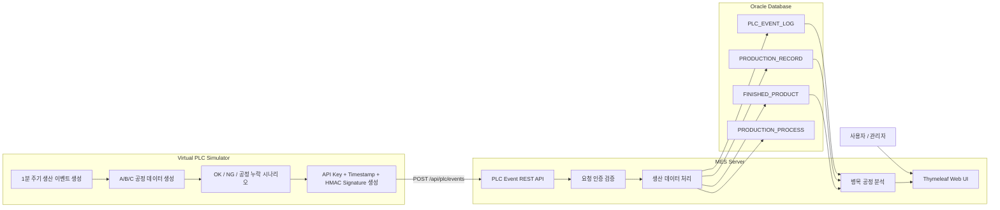

# Virtual PLC 기반 MES 생산 데이터 수집 및 분석 시스템


## 1. 프로젝트 개요

제조 현장에서 설비 데이터가 MES로 수집되는 흐름을 이해하기 위해 진행한 토이 프로젝트입니다.

Virtual PLC Simulator가 생산라인의 공정 데이터를 생성하고, MES Server는 REST API를 통해 데이터를 수신하여 Oracle DB에 저장합니다. 이후 저장된 데이터를 기반으로 PLC 이벤트 이력, 생산 실적, 완성품 현황, 제품별 공정 진행 상태, 병목 공정 분석 결과를 조회할 수 있도록 구현했습니다.

이 프로젝트는 단순 CRUD 웹 애플리케이션이 아니라, 제조 현장의 설비 데이터가 사내 전산 시스템으로 수집되고 분석되는 전체 흐름을 직접 설계하고 구현하는 것을 목표로 했습니다.

## 2. 프로젝트 목적

- PLC에서 MES로 생산 데이터가 전달되는 흐름 이해
- REST API 기반 설비 데이터 수집 구조 구현
- Oracle DB를 이용한 생산 데이터 저장 및 조회
- 공정별 사이클타임 기반 병목 공정 분석
- 제품 Serial Number 기반 공정 진행 상태 추적
- API Key, Timestamp, HMAC Signature 기반 요청 인증 구현
- 장애 상황을 Ticket 형태로 정리하며 운영 관점의 문제 해결 경험 확보
- 제조 IT / MES / DB / 인프라 운영 직무와 연결되는 프로젝트 경험 정리

## 3. 전체 아키텍처


## 4. 프로젝트 구성

```text
yyj-mes-project
├── mes-server
│   ├── PLC 이벤트 수신 API
│   ├── 생산 실적 저장
│   ├── 완성품 관리
│   ├── 제품별 공정 진행 상태 분석
│   ├── 병목 공정 분석
│   └── Thymeleaf 기반 Web UI
│
├── virtual-plc-simulator
│   ├── 가상 PLC 데이터 생성
│   ├── 주기적 생산 이벤트 전송
│   ├── OK / NG / 공정 누락 시나리오 생성
│   └── HMAC Signature 생성
│
└── docs
    ├── DB 설계 문서
    ├── 트러블슈팅 문서
    └── 프로젝트 대표 이미지
```

## 5. 주요 기능

### Virtual PLC Simulator

- 제품 Serial Number 자동 생성
- A/B/C 공정별 생산 이벤트 생성
- 공정별 Cycle Time 랜덤 생성
- OK / NG 결과 랜덤 생성
- 공정 이벤트 누락 시나리오 생성
- 1분 주기 자동 이벤트 전송
- MES Server로 REST API 요청 전송
- API Key, Timestamp, HMAC Signature 헤더 생성

### MES Server

- PLC 이벤트 수신 API 제공
- API Key 기반 요청 검증
- Timestamp 기반 요청 유효 시간 검증
- HMAC-SHA256 Signature 기반 요청 위변조 검증
- PLC 이벤트 로그 저장
- 생산 실적 데이터 저장
- A/B/C 공정 완료 여부 기반 완성품 등록
- 제품별 공정 진행 상태 조회
- 공정별 평균 Cycle Time 계산
- 시간당 처리량 계산
- 병목 공정 자동 탐지
- 테스트 데이터 초기화 기능 제공

## 6. 데이터 흐름

1. Virtual PLC Simulator가 제품 Serial Number를 생성합니다.
2. 제품은 A, B, C 공정을 순서대로 거친다고 가정합니다.
3. 각 공정별 생산 이벤트가 생성됩니다.
4. Virtual PLC Simulator는 MES Server의 `/api/plc/events` API로 이벤트를 전송합니다.
5. MES Server는 요청의 API Key, Timestamp, HMAC Signature를 검증합니다.
6. 인증이 통과된 이벤트는 Oracle DB에 저장됩니다.
7. 저장된 PLC 이벤트를 기반으로 생산 실적 데이터가 생성됩니다.
8. A/B/C 공정이 모두 정상 완료된 제품은 완성품으로 등록됩니다.
9. 저장된 데이터를 기반으로 제품 진행 상태와 병목 공정을 분석합니다.

## 7. 병목 공정 분석 방식

공정별 평균 Cycle Time을 계산한 뒤, 시간당 처리량을 산출했습니다.

```text
시간당 처리량 = 3600 / 평균 Cycle Time
```

시간당 처리량이 가장 낮은 공정을 병목 공정으로 판단했습니다.

예를 들어 B 공정의 평균 Cycle Time이 가장 길다면, B 공정의 시간당 처리량이 가장 낮아지고 해당 공정이 병목으로 탐지됩니다.

## 8. 보안 설계

PLC와 MES Server 간 요청 위변조를 방지하기 위해 다음 인증 방식을 적용했습니다.

### API Key

허용된 Virtual PLC에서 들어온 요청인지 확인합니다.

### Timestamp

요청 시간이 서버 기준으로 허용 범위를 벗어나면 차단합니다. 이를 통해 오래된 요청을 재사용하는 공격을 방지할 수 있습니다.

### HMAC Signature

요청 데이터와 Secret Key를 기반으로 HMAC-SHA256 Signature를 생성합니다. MES Server는 동일한 방식으로 Signature를 다시 계산하여 요청 데이터가 중간에 변경되지 않았는지 검증합니다.

## 9. 주요 데이터

### PLC Event Log

Virtual PLC에서 전송한 원본 이벤트를 저장합니다.

주요 데이터:

- Event ID
- Line Code
- Equipment Code
- Process Code
- Product Serial Number
- Event Type
- Production Quantity
- Cycle Time
- Result
- Equipment Status
- Occurred At

### Production Record

공정별 생산 실적 데이터를 저장합니다.

주요 데이터:

- 공정 코드
- 제품 Serial Number
- 생산 수량
- Cycle Time
- 생산 결과
- 기록 시간

### Finished Product

A/B/C 공정이 모두 정상 완료된 제품 정보를 저장합니다.

주요 데이터:

- 제품 Serial Number
- 완료 시간
- 최종 결과

## 10. 기술 스택

- Java 17
- Spring Boot
- Spring Data JPA
- Thymeleaf
- Oracle Database
- Docker
- Gradle
- REST API
- HMAC-SHA256
- Git / GitHub

## 11. 실행 방법

### Oracle DB 실행

```bash
docker start yyj-oracle
```

### MES Server 실행

```bash
cd mes-server
./gradlew bootRun
```

MES Server는 기본적으로 `http://localhost:8080`에서 실행됩니다.

### Virtual PLC Simulator 실행

```bash
cd virtual-plc-simulator
./gradlew bootRun
```

Virtual PLC Simulator는 기본적으로 `http://localhost:9090`에서 실행됩니다.

## 12. 주요 화면

- 홈 화면
- PLC 이벤트 목록
- 생산 실적 목록
- 완성품 목록
- 제품별 공정 진행 상태
- 제품별 총 Cycle Time 분석
- 병목 공정 분석 대시보드

## 13. 트러블슈팅

프로젝트 진행 중 발생한 문제를 Ticket 형태로 정리했습니다.

예시:

- Oracle DB 컨테이너 미실행으로 인한 DB 연결 실패
- MES Server 미실행 상태에서 Virtual PLC 요청 실패
- API Key 불일치로 인한 인증 실패
- HMAC Signature 검증 실패
- `@EnableScheduling` 누락으로 인한 주기적 이벤트 미생성
- 소스 코드 변경 후 빌드 결과 미반영 문제
- SQL Developer 접속 설정 오류

## 14. 향후 개선 방향

- DB 설계 문서 고도화
- ERD 작성
- 장애 Ticket 문서 정리
- TLS 기반 DB 통신 보안 적용
- 관리자 화면 UI 개선
- 공정별 설비 상태 모니터링 기능 추가
- 생산량 추이 차트 추가
- Docker Compose 기반 실행 환경 구성
- 테스트 코드 보강

## 15. 프로젝트를 통해 학습한 점

이 프로젝트를 통해 제조 현장에서 발생하는 설비 데이터가 MES와 같은 사내 전산 시스템으로 수집되는 흐름을 이해할 수 있었습니다.

또한 단순히 데이터를 저장하는 것에 그치지 않고, 수집된 데이터를 기반으로 생산 실적, 완성품, 제품 진행 상태, 병목 공정을 분석하는 구조를 직접 구현했습니다.

특히 REST API, DB 연동, 인증 보안, Docker 기반 Oracle DB 환경, 장애 상황 정리까지 경험하면서 제조 IT 시스템이 단순 개발뿐만 아니라 운영, 보안, 데이터 관리 관점까지 함께 고려해야 한다는 점을 배울 수 있었습니다.